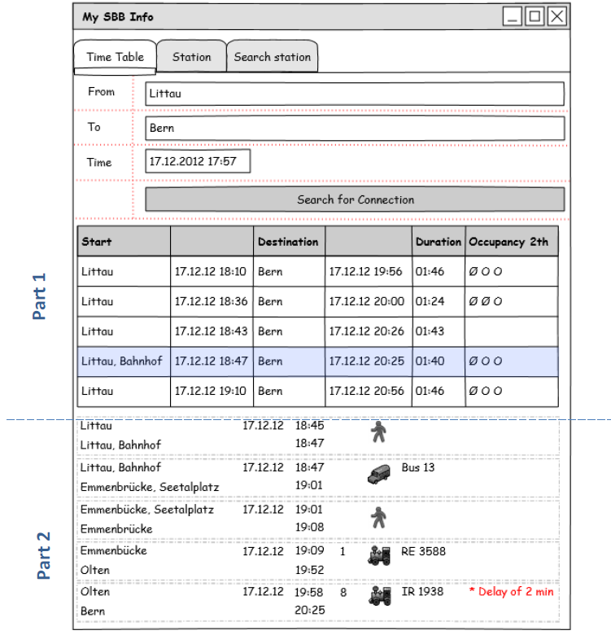
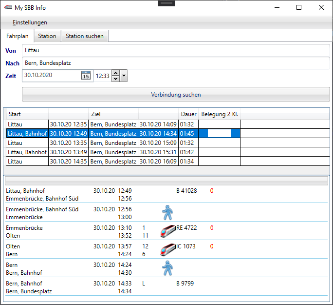

# bbv Academy - WPF Basics

## Workshop

Contains besides the basic WPF examples the Workshop Code for the My SBB Info App. The Workshop documents with all tasks will be handed out at the course day.

### Draft

### Implementation

